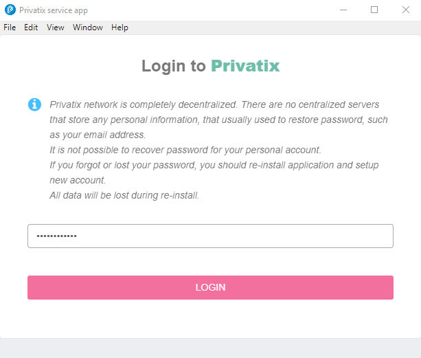
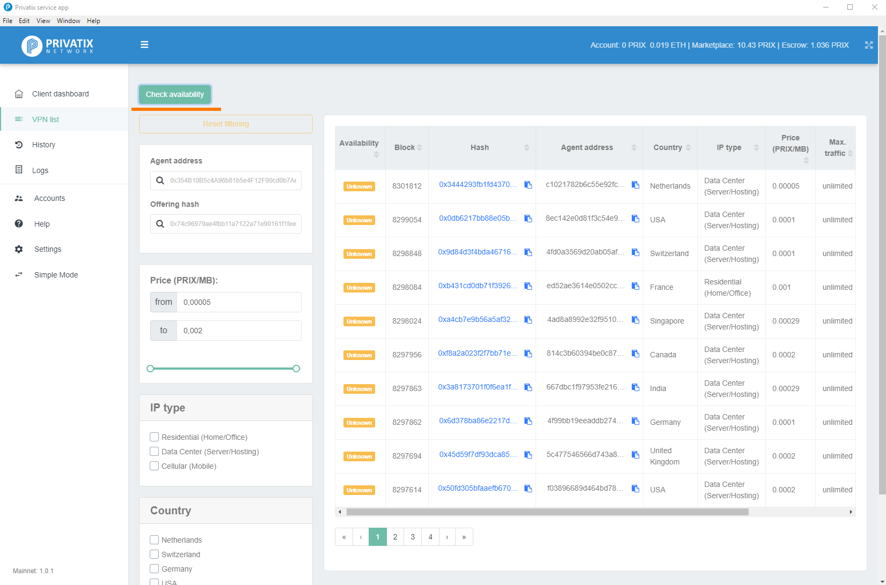
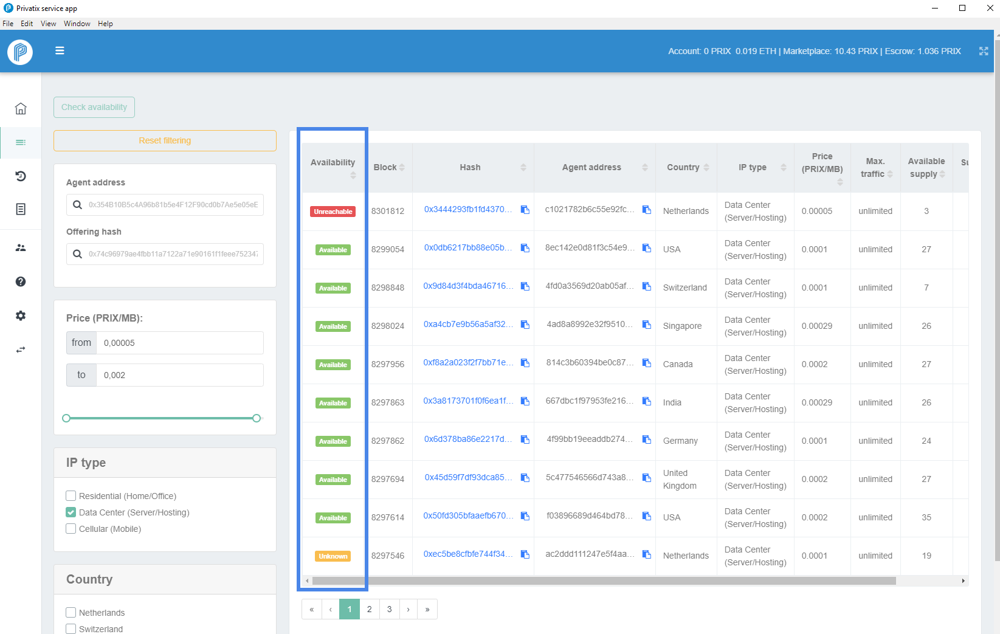
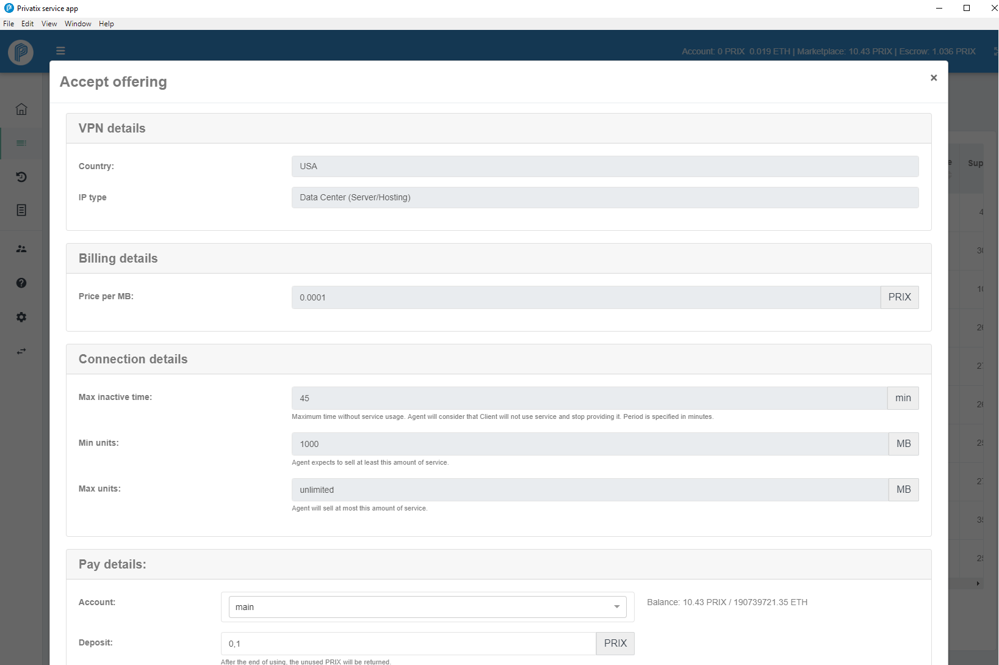
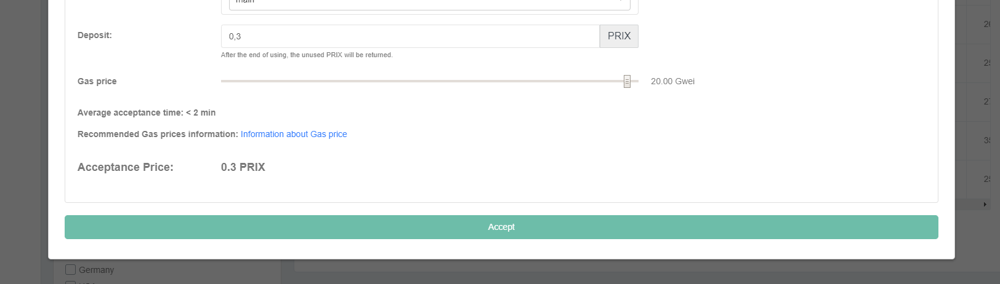
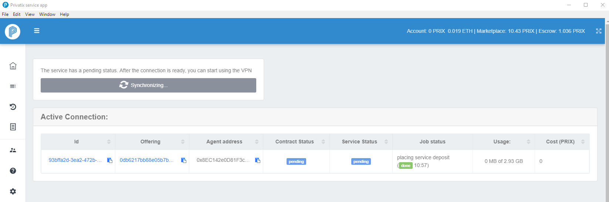
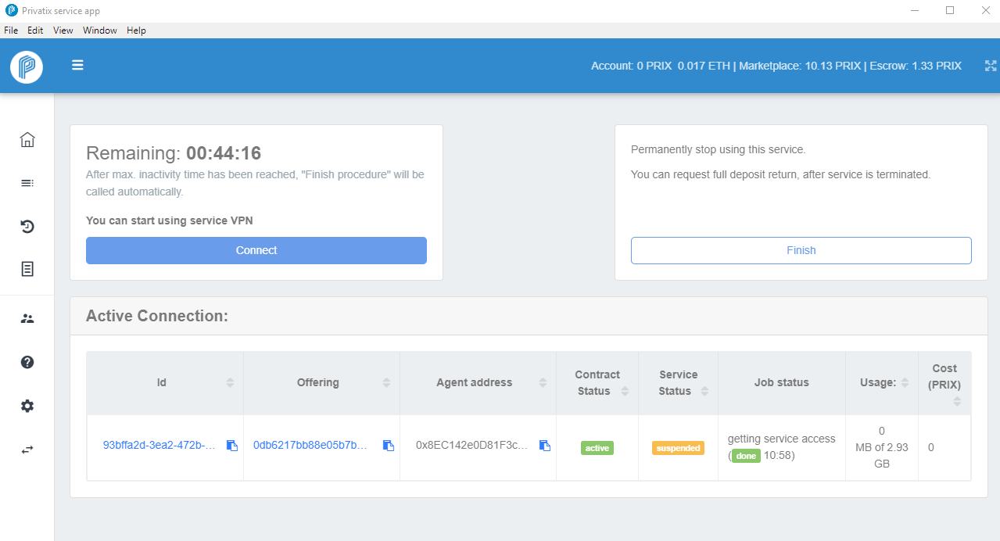
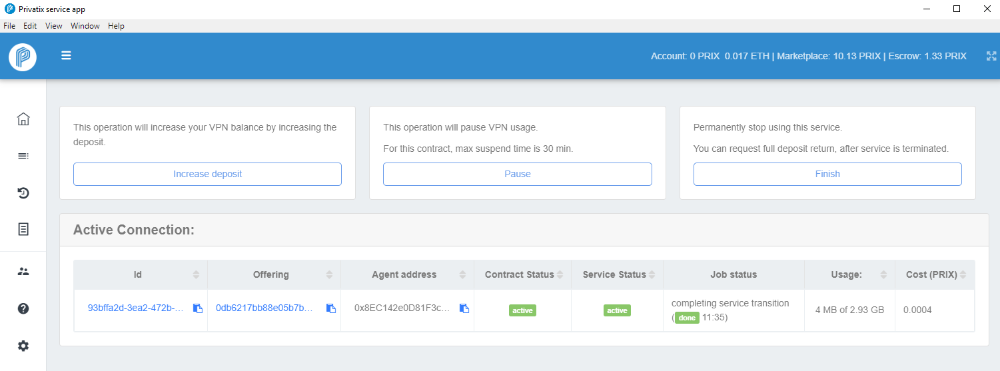

# How to buy VPN service

To start using VPN services, you should install [Pivatix Core software](https://privatix.io/#download) in Client mode. Follow the wizard's instructions to create account and [load your balance with PRIX /ETH tokens](https://docs.privatix.network/knowledge-base/how-to-get-prix) in order to pay for the services across Privatix Network.


Please note, when you accept VPN offering, the selected amount of PRIX tokens from Marketplace balance will be deposited as Escrow. PRIX will be automatically returned from Escrow to your Marketplace balance when the VPN offering will be normally closed or manually terminated from the History menu. 

ETH is used to cover GAS costs for blockchain transactions.


### Open the Privatix Client application in Advanced mode

### Select "VPN list" from the menu. 

Now you can see all available offerings. Use filters to select the VPN services you are interested in.

#### Click on "Check availability" button to check the status of offerings. 

On "Available" column you can see which offerings are available after the check.

### Click on Hash to review the offering:

### Decide how much PRIX you want to deposit on this service and click "Accept".

### Wait until the offering is synchronized

### Click "Connect" to start using VPN. 

If connection is succesfull, the Service status will be changed to **active**

#### Now VPN is connected. You can see the stats under the "Active Connection" details.

