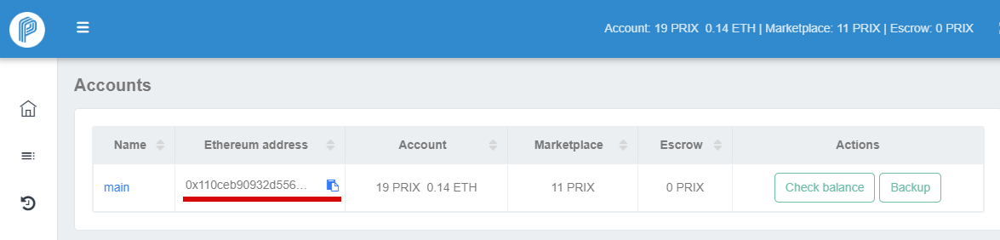

# How to get PRIX

**PRIX**, an ERC20 token on the Ethereum Blockchain, is internal crypto-currency to exchange value \(utility\) between Privatix Network participants. 

To provide or consume services on Privatix Network, you must first transfer some PRIX tokens to your Privatix Network account.


Please note, you should also load some **ETH** \(Ethereum\) tokens to your account balance, because when you do anything on the Ethereum blockchain, you must pay for that computation. That payment is calculated in gas, and gas is always paid in ETH.


On the final step of software installation, wizard will give you the address of your Privatix account and guide you how to fund your balance with PRIX and ETH .

### How to get PRIX tokens:

You can buy PRIX tokens on cryptocurrency exchanges:

1. [**COSS.io**](http://coss.io) **\(** [**PRIX/ETH**](https://coss.io/c/trade?s=PRIX_ETH) **\)**
2. [**Mercatox.com**](http://mercatox.com) **\(** [**PRIX/BTC**](https://mercatox.com/exchange/PRIX/BTC) **\)** 
3. [**IDEX**](http://idex.market) **\(** [**PRIX/ETH**](https://idex.market/eth/prix) **\)**
4. [**Yobit.net**](http://yobit.net) **\(** [**PRIX/BTC**](https://yobit.net/en/trade/PRIX/BTC) **\)**
5. [**ForkDelta**](http://forkdelta.app) **\( Etherdelta \) \(** [**PRIX/ETH**](https://forkdelta.app/#!/trade/PRIX-ETH) **\)**

When you get PRIX on exchanges, you can withdraw it directly to your Privatix Network account balance or store it on any ERC20 compatible wallet.


Please note, If you have any difficulties with buying PRIX using exchanges or this method is not suitable for you, you can always use our [**Swap service**](https://swap.privatix.network)**.**


You can always check available markets and charts here:

[**https://coinmarketcap.com/currencies/privatix/\#charts**  
](https://coinmarketcap.com/currencies/privatix/#charts)[**https://www.coingecko.com/en/coins/privatix**](https://www.coingecko.com/en/coins/privatix) ****

\*\*\*\*

### How to get ETH :

You can buy ETH tokens on the available exchanges where ETH is traded or use any of these online services:

1. [**Shapeshift**](https://shapeshift.io/)
2. [**Changelly**](https://changelly.com/)
3. [**CEX**](https://cex.io/)
4. [**LocalEthereum**](https://localethereum.com/)
5. [**Dether**](http://dether.io/)
6. and many many more.

### Where to store PRIX and ETH tokens:

Suggested ERC20 compatible wallets:

* [**Myetherwallet.com**](https://www.myetherwallet.com/)
* [**Metamask.io**](https://metamask.io/)
* [**Parity.io**](https://parity.io/)
* [**Token.im**](https://token.im/)

Compatible hardware wallets:

* [**Trezor.io**](https://trezor.io/)
* [**Ledgerwallet.com**](https://www.ledgerwallet.com/)

### 

