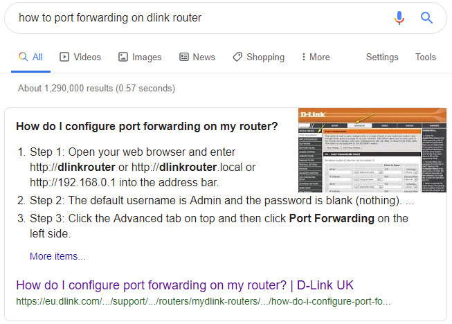

# How to open ports for Agent

Privatix Agent uses the computer's network interface to listen for inbound connections from Privatix Network clients. It is necessary to configure port forwarding on your internet router to provide the services across Privatix Network. 


The required ports will be specified during the installation of Privatix Agent software.

by default: 59000 \(UDP\) , 9000 \(TCP\)


### How to add Port Forwarding on the router:

1. Login to the router admin page 
2. Navigate to the router's port forwarding section \(or Virtual servers\).
3. Add forwarding rules for ports issued by Privatix Agent during installation.


Please note, it is recommended to assign on router a static IP address for your computer or device \(by MAC address\) where Privatix Agent is running. Otherwise, on some router models your device's internal IP may be changed after reconnection, and therefore the port forwarding rules may stop to working.

You may also check if UPnP settings are enabled, usually it will work if available.


### 

### How to check Port Forwarding:

You can check if ports are Reachable on Privatix Network port checker: [https://privatix.network/portcheck/](https://privatix.network/portcheck/)

### How to find a Port Forwarding guide with the specified router model:

1. Check your router model. 
2. Open web search \(e.g., google.com \).
3. Type “how to port forwarding on _\(your router model here\)_ “ .
4. Follow the guide.

### 

### Additional information about Port Forwarding: 

* [https://www.lifewire.com/how-to-port-forward-4163829](https://www.lifewire.com/how-to-port-forward-4163829)
* [https://www.howtogeek.com/66214/how-to-forward-ports-on-your-router/](https://www.howtogeek.com/66214/how-to-forward-ports-on-your-router/)

  

