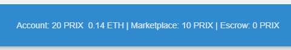

# How to withdraw funds

**PNCS** is operating with **PRIX** tokens which is based on Ethereum, therefore, some amount of ETH is necessary to cover GAS costs. 

If you are not familiar with Ethereum and ERC20 token standard , please check this first : 

* [Ethereum for beginners  ](https://cointelegraph.com/ethereum-for-beginners)
* [ERC20 Explained](https://cointelegraph.com/explained/erc-20-tokens-explained)

### Funds management 

The most important is to understand that no one will be able to restore your passwords or private keys if you lost it. 

When you install the PNCS, you will start with wizard which will guide you step-by-step. 


Please do not forget to write down your password and keep the backup of your private key in a safe place.


The PNCS ****account is represented by your ETH public key. Your private key is encrypted and used only by the software to operate within the network.

The Agents and Clients should have PRIX to execute any bandwidth deals and certain amount of ETH to cover transaction costs \(GAS\). 

There are 3 places where your funds \(PRIX and ETH\) can be located.

### 1\) Account 

The Account is yours ETH address with backup you made during the software installation. The backup is always available for download \(but not the password\).

#### How to move funds to Account ? 

* Send PRIX and ETH directly to the Ethereum address \(public key\).
* Exchange popular crypto to PRIX and ETH using our easy [Swap service](https://swap.privatix.network).

#### How to move funds from Account ?

* Unlock your account using the keystore file \(backup\) and your password on any of the popular services such as Metamask, MEW, etc. \(Please note, the service must be ERC20 compatible\)
* Send your funds to any ETH wallet or exchange.  

### 2\) Market 

Privatix Network Smart contract which is responsible to allow P2P communication and accounting between Agents and Clients. The Market operates with PRIX only. More information can be found here: [Payments](../privatix-core/core/payments/)

#### How to move funds in ? 

* In Advanced mode the PRIX can be moved in by user's action only.
* In Simple mode the transfer from Account to Market is automatic. 
* PRIX may move automatically into the Market from Escrow when buying/selling traffic operation occurred \(smart contract operations\).  

#### How to move funds out ?  

* The user may transfer funds to Account anytime. In case of Client Simple mode, the user should switch to Advanced mode first. 
* PRIX may move automatically from the Market to Escrow when buying/selling traffic operations occur \(smart contract operations\). 

#### 

### 3\) Escrow ****

Privatix Network Smart contract which is responsible to ensure fair P2P deals between Agents and Clients. PRIX may be moved \(locked\) on Escrow from Market only. More information can be found here: [Payments](../privatix-core/core/payments/)

#### How to move funds in? 

* Automatically, when buying/selling traffic operation occurred \(smart contract operations\)

#### How to move funds out? 

* Automatically, when buying/selling traffic operation occurred \(smart contract operations\) 
* Manually, to terminate all the contracts in relevant menu \(24 hours delay period may take a place in case of uncooperative closes\)

### Questions:

> #### I have used your service as a Client and don’t want to use it anymore, what should I do to withdraw all the rest funds ?

1. Terminate all the contracts you have. 
2. Wait 24 hours.
3. Transfer PRIX from Market to Account. 
4. Use the private keystore file \(backup\) and password to further operation with PRIX tokens or ETH. Further operations can be performed with any wallets that support import keystore files \(e.g. Metamask\).

  

\*\*\*\*

### \*\*\*\*

  

