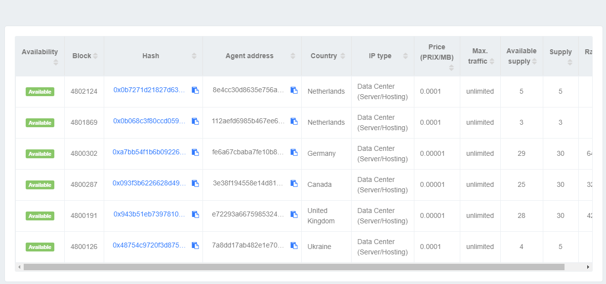
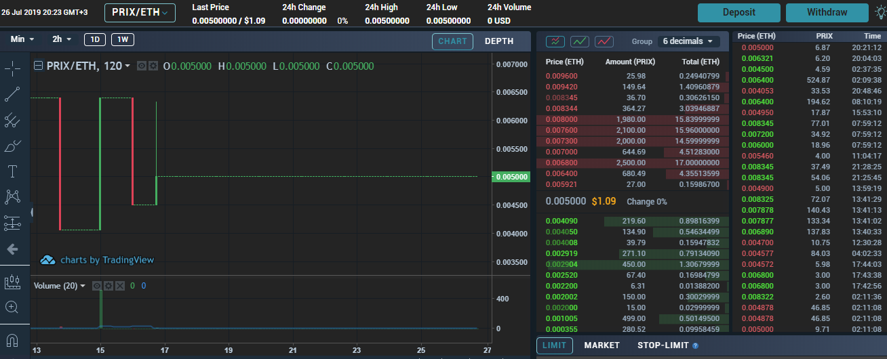

# Traffic prices formation

> **\***

The price of bandwidth in Core software is defined as PRIX/MB only. The unit of account is PRIX \(ERC20 token\), and the basic unit of measurement is MB \(megabytes\).

The software doesn’t refer in any way to a fiat price, as USD/MB for example. But, obviously, the users only care about USD/MB prices.

The goal of this article is to explain what factors may influence bandwidth prices in fiat.

### The markets

The users operate in two primary markets:

#### 1\) PRIX/MB - Bandwidth marketplace on Blockchain : 

* The integral part of Core software with pure P2P interaction
* The supply within the network is the Agents offerings. 
* The Agents set PRIX/MB prices, how much bandwidth they want to sell, and on what conditions.  
* The Clients may see the offerings from Agents and decide whether to accept them or not. 
* Since prices are dictated by Agents, they must adjust their behavior to the demand of the Clients.
* On Core software, Clients can’t "declare" desirable prices; they may accept the offering or not. 

#### 2\) PRIX/USD - the external market for PRIX token : 

* The price is determined by using data from various exchanges, where PRIX token is available for trading.
* Exchanges may be centralized or decentralized.
* The PRIX price available on price aggregators like [CoinGecko](https://www.coingecko.com/en/coins/privatix), for example. 
* The price formation is in accordance with supply and demand on exchanges.


USD/MB is entirely determined by the markets listed above. The most important thing to understand is that PRIX/MB does not similar to an asset market. Agents do not actually “own” MBs and cannot "keep" them for sale at more favorable prices. If PRIX/MB is volatile, almost everyone will only be affected by the much more stable [moving average](https://en.wikipedia.org/wiki/Moving_average). 


### Strategies

The Agent's strategy is to optimize the revenues from bandwidth selling. The Agents should check what other Agents propose and position their offering accordingly.

To adjust the offering, Agents should take into consideration many parametres, but the most important are: Country, Type of IP-address, Rating and the price itself.

The Client's strategy is to buy the best quality traffic as possible at the lowest prices. Clients should check the Agents' offerings and may accept it. If there is no suitable offer, there is nothing the Client can do.

More information you can find in [our technical documentation](../privatix-core/core/).

### Inevitable price volatility

Privatix Network Core software is our first step towards building a worldwide distributed broadband network on the mainnet.

Since we are at the very beginning, the number of Agents and Clients \(capacity of the network\) can be very different from time to time. As less network capacity we have, the more volatility we’ll see.

#### **The network users should be aware of the following :** 

* The prices of PRIX token in USD are determined on external exchanges and may be very volatile. This may cause dramatic USD/MB price moves in both directions.
* The GAS costs are also involved. It can influence the effective \(real\) price of bandwidth.
* The software is in Beta stage, use it at your own risk 

**There is no way to eliminate these risks of volatility while the network is still small. Gradually, as the network capacity will grow, the volatility is expected to decrease.**  

