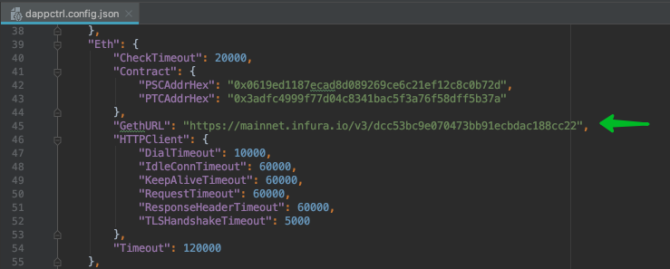

# Via the application

If you are in simple Mode, then go to the advanced mode:

Go to the logs page

First, filter the logs by `error` and try to analyze what happened:

Then you can collect logs from all parts of the application \(DB included\) by pressing on the `Export all logs to a file` button.

You will receive a full archive of the application logs. 

If you contact the support team, you should send this archive to them.

