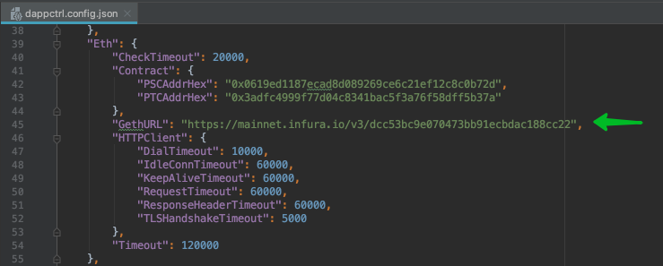

# How to change Infura Endpoint

## Step 1. Get Infura endpoint

Get Infura endpoint: [How to get Infura Endpoint](how-to-change-infura-url.md)

## Step 2. Replace Endpoint in the config file:

1. Find **dappctrl.config.json**. The path to the configuration depends on which folder you have installed the application in. The relative path will be as follows: `$app_path/client/dappctrl/dappctrl.config.json`
2. Stop the application if it is running
3. Replace `GethURL` value in `dappctrl.config.json`
4. Start the application

