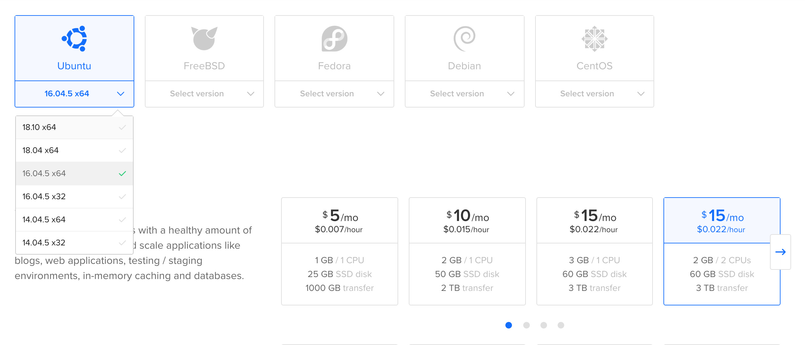

# Install Privatix Agent Node to a DigitalOcean cloud

## Prepare a virtual machine 

Minimum system requirements:

* 2GB of RAM
* 2 vCPU
* OS: Ubuntu 18.04 LTS

### Create a droplet 

Before installation you need to create [a droplet:](https://www.digitalocean.com/products/droplets/)

* [Login](https://cloud.digitalocean.com/login) to the digital ocean cloud  
* Choose a standard droplet
* Choose OS and parameters according to minimal system requirements
* Go through the Wizard's steps.
* After 2-3 minutes the droplet will be available for `ssh` access

## **Install Privatix Agent**

Connect to the Droplet via ssh and follow the instructions: [CLI: Install Privatix Agent Node](cli-install-privatix-agent-node.md)

